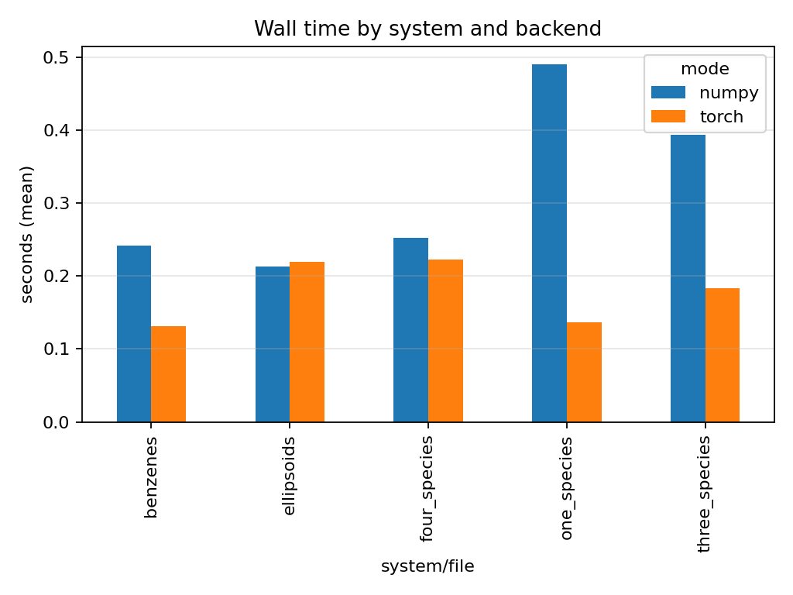

# Cersonsky Lab — AniSOAP Optimization

_Reproducible profiling & optimization of **AniSOAP** (Cersonsky Lab, UW–Madison): scripts, figures, traces, and PyTorch/HPC configs._

**Owner:** Tejas Dahiya ([@Tejas7007](https://github.com/Tejas7007))  
**Mentors:** Arthur Lin, Dr. Rose Cersonsky

---

## Table of Contents
- [Repository Contents](#repository-contents)
- [Artifacts Intake](#artifacts-intake)
- [TL;DR Results](#tldr-results)
- [Figures](#figures)
- [Detailed Worklog](#detailed-worklog)
- [Thread Parity (fair CPU tests)](#thread-parity-fair-cpu-tests)
- [Reproduce Locally](#reproduce-locally)
- [Acknowledgements](#acknowledgements)
- [Citation](#citation)

---

## Repository Contents

```text
scripts/
├─ organize_artifacts.py   # Ingest .tgz/.zip bundles into results/
├─ plot_results.py         # Produce figures from timings_* CSVs
└─ export_env.py           # Dump Python/PyTorch/CUDA env details

results/
├─ tables/
│  ├─ timings.csv
│  ├─ timings_chtc.csv
│  ├─ timings_local.csv
│  ├─ summary_local.csv
│  ├─ env_report.json
│  ├─ ellipsoids_{numpy,torch}.metrics.json
│  ├─ one_species_{numpy,torch}.metrics.json
│  ├─ three_species_{numpy,torch}.metrics.json
│  └─ four_species_{numpy,torch}.metrics.json
├─ figures/
│  ├─ scaling_species.png
│  └─ util_before_after.png
├─ profiler_traces/
└─ logs/
   ├─ chtc/
   └─ local/

examples/
README.md



