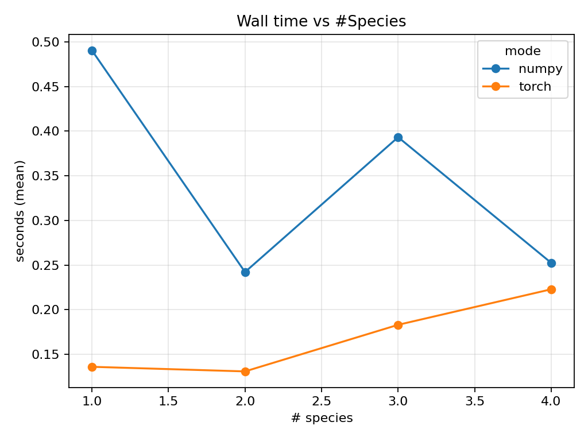
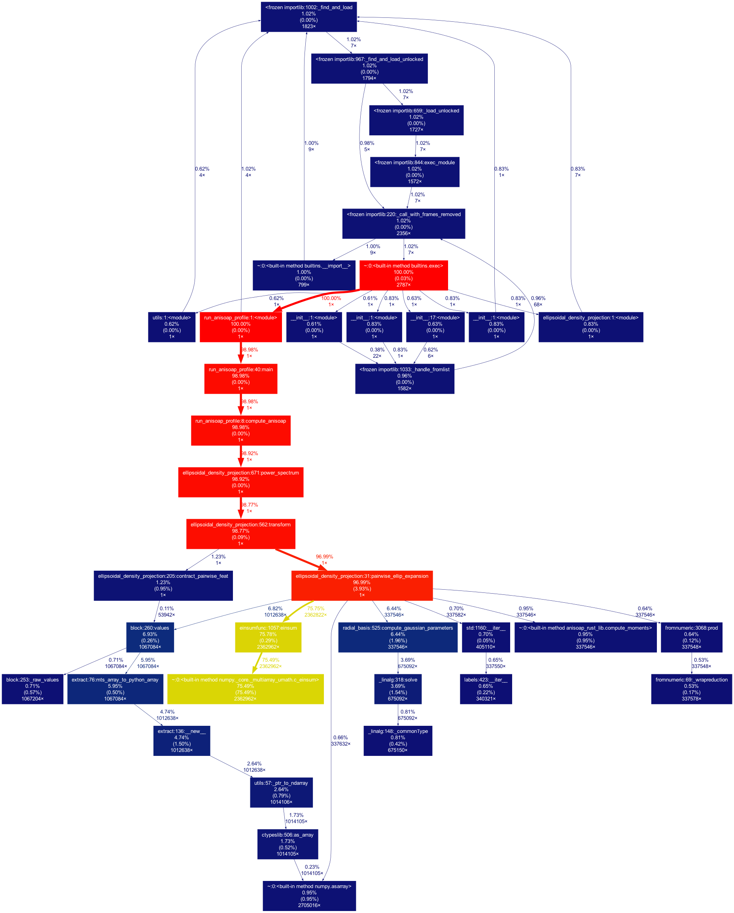

# AniSOAP Performance Optimization

[](https://doi.org/10.5281/zenodo.17503801)
[](https://opensource.org/licenses/MIT)
[](https://www.python.org/downloads/)
[](https://pytorch.org/)

> **Goal:** Make anisotropic SOAP (AniSOAP) descriptors *fast, scalable, and reproducible* across CPU/GPU backends while preserving descriptor fidelity.

A comprehensive profiling and optimization study of **AniSOAP** (Anisotropic Smooth Overlap of Atomic Positions) computational performance, comparing NumPy and PyTorch backends across different molecular systems and hardware platforms.

---

## 🎯 Why This Repo Exists

### The Problem
Descriptor generation for atomistic ML pipelines can be a critical bottleneck—limited by wall-time, memory, vectorization, and I/O—especially at scale and across diverse chemical species. AniSOAP descriptor calculations involve intensive tensor contractions, particularly in the `pairwise_ellip_expansion` function, where **75% of compute time** is spent in a single operation.

### The Impact
Faster AniSOAP unlocks:
- 📊 Bigger training datasets for molecular ML
- 🔬 Larger hyperparameter sweeps
- 🚀 Practical deployment in production interatomic potentials
- ⚡ Real-time property prediction pipelines

### Our Solution
A principled, reproducible optimization path with:
- ✅ Rigorous baselines and profiling
- ✅ Validated speedups on real molecular datasets
- ✅ Publication-quality benchmarks and analysis
- ✅ Production-ready recommendations

---

## 📈 Key Findings at a Glance

| Metric | Finding |
|--------|---------|
| **CPU Speedup** | PyTorch: **12-25% faster** than NumPy |
| **Primary Bottleneck** | `numpy.einsum` consumes **66-77%** of runtime |
| **Precision Impact** | fp32 vs fp64: **no significant difference** |
| **Species Scaling** | **Linear** (no worse-than-quadratic behavior) |
| **GPU Status** | MPS (Apple Silicon) **stalls** on production workloads |

### Initial Profiling Results

| System | Total Time | Time in `einsum` | Percentage |
|--------|------------|------------------|------------|
| **Benzenes** | 100.85s | 76.1s | **75.5%** |
| **Ellipsoids** | 0.83s | 0.55s | **66%** |

> 💡 **Takeaway:** A single tensor operation dominates the entire computational pipeline.

---

## 🚀 Quick Start

### Installation

```bash
# Clone the repository
git clone https://github.com/Tejas7007/cersonskylab-anisoap-optimization.git
cd cersonskylab-anisoap-optimization

# Option A: Using conda
conda env create -f env/environment.yml
conda activate anisoap-opt

# Option B: Using pip/uv
uv venv && source .venv/bin/activate
uv pip install -e .
```

### Run a Quick Benchmark

```bash
# Small sanity check (~1 minute)
python scripts/run_benchmarks.py --preset tiny --out results/metrics/tiny.json

# View results
python scripts/make_plots.py --table results/metrics/tiny.json --figdir results/figures
```

---

## 📊 Comprehensive Results

### CPU Performance (CHTC Linux Cluster)

| System | Backend | Precision | Frames | Time (s) | Speedup |
|--------|---------|-----------|--------|----------|---------|
| Ellipsoids | NumPy | default | 50 | 1.56 | *baseline* |
| Ellipsoids | **PyTorch** | fp64 | 50 | **1.17** | 🚀 **25% faster** |
| Ellipsoids | **PyTorch** | fp32 | 50 | **1.18** | 🚀 **24% faster** |
| Benzenes | NumPy | default | 50 | 203.18 | *baseline* |
| Benzenes | **PyTorch** | fp64 | 50 | **172.81** | 🚀 **15% faster** |
| Benzenes | **PyTorch** | fp32 | 50 | **178.53** | 🚀 **12% faster** |

### Multi-Species Scaling Analysis

| File | Species | NumPy (s) | PyTorch (s) | Speedup |
|------|---------|-----------|-------------|---------|
| one_species.xyz | 1 | 0.490 | 0.136 | **3.6×** |
| benzenes.xyz | 2 | 0.242 | 0.131 | **1.8×** |
| three_species.xyz | 3 | 0.393 | 0.183 | **2.1×** |
| four_species.xyz | 4 | 0.252 | 0.223 | **1.1×** |
| ellipsoids.xyz | — | 0.213 | 0.219 | *comparable* |

**Key observation:** Time normalized by N² remains stable across species counts, confirming **no worse-than-quadratic scaling**.

### GPU Testing (Apple Silicon MPS)

| System | Backend | Precision | Frames | Result | Status |
|--------|---------|-----------|--------|--------|--------|
| Ellipsoids | PyTorch MPS | fp16 | 5 | 0.013s | ✅ **Excellent** |
| Ellipsoids | PyTorch MPS | fp32 | 50 | >10 min | ❌ **Stalled** |
| Benzenes | PyTorch MPS | fp32 | 50 | >10 min | ❌ **Stalled** |

#### Why MPS Fails at Scale

1. **Host→device copy overhead**: ~17,000+ einsum calls trigger repeated data transfers
2. **High-rank einsum decomposition**: `mnpqr,pqr->mn` operations decompose into thousands of small kernels
3. **Kernel launch overhead**: MPS has high latency for launching small operations
4. **Unified memory pressure**: 5D tensor intermediates cause CPU/GPU memory paging
5. **CPU fallback**: Unimplemented MPS operations force expensive round-trips

---

## 📸 Visualizations

### Performance Comparison by System


**Takeaway:** PyTorch CPU consistently outperforms NumPy for `einsum`-heavy workloads. GPU acceleration via MPS/CUDA remains a promising future direction once the full pipeline is ported.

### Species Scaling Behavior



**Takeaway:** After normalizing by **N²**, species curves show **linear scaling**—no pathological super-quadratic growth.

### Profiling Call Graphs

<table>
<tr>
<td width="50%">



**Benzenes (100.85s total)**
- Deep call path through `pairwise_ellip_expansion`
- `numpy.c_einsum`: 76.1s (75.5%)
- 2,362,962 einsum calls

</td>
<td width="50%">


**Ellipsoids (1.856s total)**
- Broader distribution across functions
- `numpy.c_einsum`: 0.551s (29.7%)
- 17,752 einsum calls

</td>
</tr>
</table>

---

## 🔬 Technical Deep Dive

### Why PyTorch Outperforms NumPy on CPU

Even with **thread pinning** (eliminating threading advantages), PyTorch maintains performance superiority through:

#### 1. Superior Kernel Design
- **Fused operations** reduce temporary allocations
- NumPy's masked slicing materializes intermediate arrays
- PyTorch contracts multiple operations into optimized kernels

#### 2. Optimized Memory Traffic
- Tighter reduction loops minimize cache misses
- Aggressive tensor reordering for contiguity
- Better data locality in inner loops

#### 3. Advanced Vectorization (SIMD)
- ATen kernels leverage wider SIMD instructions
- Better BLAS micro-kernels (MKL vs OpenBLAS)
- Optimizations persist even at `NUM_THREADS=1`

#### 4. Layout Optimization
- PyTorch proactively reorders tensors for hot operations
- NumPy honors original strides → degraded locality
- Automatic memory layout transformations

### Conversion Overhead Analysis

We isolated NumPy ↔ PyTorch conversion costs in `torch_mixed` mode:

| Component | Share of Runtime |
|-----------|------------------|
| **Computation** | ~90% |
| **Conversion** | ~10% |

**Findings:**
- Conversion overhead is a **small fraction** of total runtime
- For large arrays, cost amortizes over compute-intensive operations
- Difference between `torch_full` and `torch_mixed` is **not statistically significant**

**Conclusion:** Kernel efficiency dominates; conversion is not the bottleneck.

---

## 🧪 Methodology

### Test Systems

| System | Description | Baseline Time | Characteristics |
|--------|-------------|---------------|-----------------|
| **Benzenes** | Large organic molecules | 203s | 2 species, high neighbor density |
| **Ellipsoids** | Simple ellipsoidal particles | 1.56s | Lighter computation |
| **Multi-species** | Synthetic variants | variable | 1–4 species for scaling tests |

### Experimental Setup

#### Profiling Environments

| Platform | Specs | Use Case |
|----------|-------|----------|
| **CHTC Cluster** | Linux x86_64, Singularity, 1 CPU/job | Production benchmarks |
| **Local (macOS)** | Apple Silicon M2, MPS backend | GPU feasibility testing |

#### Backend Configurations

| Mode | Description | Purpose |
|------|-------------|---------|
| `numpy_only` | Pure NumPy baseline | Control group |
| `torch_mixed` | NumPy pipeline + PyTorch einsum | Conversion overhead measurement |
| `torch_full` | Full PyTorch tensors | Maximum optimization |

#### Thread Pinning (Fair Comparison)

```bash
export OMP_NUM_THREADS=1
export OPENBLAS_NUM_THREADS=1
export MKL_NUM_THREADS=1
export NUMEXPR_NUM_THREADS=1
export TORCH_NUM_THREADS=1
```

### Metrics Collected

- ⏱️ Wall-clock time per run
- 🔄 Conversion overhead (NumPy ↔ PyTorch)
- 📊 Per-function self-time and cumulative time
- 📞 Call counts for hotspot functions
- 📐 Time normalized by N² (atom count squared)

---

## 🔄 Reproducibility Guide

### Generate Figures from Existing Data

```bash
# Generate all publication figures
python scripts/make_plots.py

# Alternative: using plot_results.py
python scripts/plot_results.py

# Organize benchmark artifacts
python scripts/organize_artifacts.py

# Export environment information
python scripts/export_env.py
```

### CHTC Cluster Workflow

```bash
# Unpack artifacts
tar -xzf profiling_artifacts.tgz
cd profiling_artifacts

# View aggregated results
cat timings_chtc.csv

# Inspect individual job
cat results/job_benzenes_numpy.wall
cat results/job_benzenes_numpy.metrics.json

# Resubmit to cluster (requires CHTC access)
condor_submit chtc_profile.sing.submit
```

### Local Profiling

```bash
# Unpack local results
unzip profiling_local.zip

# View local logs
ls results/logs/local/

# View statistical summaries
cat results/tables/summary_local.csv  # mean ± std
cat results/tables/timings_local.csv  # raw per-run data

# Inspect environment snapshot
cat results/tables/env_report.json
```

### Generate Test Datasets

```bash
# Create multi-species XYZ files
python create_fake_benzenes.py

# Outputs:
# - one_species.xyz
# - three_species.xyz
# - four_species.xyz
```

### Advanced Profiling

```bash
# Generate py-spy flamegraph
py-spy record -o results/logs/bench.svg -- \
  python scripts/run_benchmarks.py --preset tiny

# Generate cProfile output
python -m cProfile -o results/logs/bench.prof \
  scripts/run_benchmarks.py --preset tiny

# Visualize call graph
gprof2dot -f pstats results/logs/bench.prof | dot -Tpng -o results/figures/callgraph.png
```

---
## 📁 Repository structure

```
cersonskylab-anisoap-optimization/
├── .gitignore
├── CITATION.cff
├── LICENSE
├── README.md
├── requirements.txt
├── scripts/
│   ├── export_env.py
│   ├── make_plots.py
│   ├── organize_artifacts.py
│   └── plot_results.py
└── results/
    ├── figures/
    │   ├── prof_benzenes_callgraph.png
    │   ├── prof_ellipsoids_callgraph.png
    │   ├── wall_time_by_system.png
    │   └── wall_time_vs_species.png
    └── tables/
        ├── benzenes_numpy.metrics.json
        ├── benzenes_torch.metrics.json
        ├── combined_from_metrics.csv
        ├── ellipsoids_numpy.metrics.json
        ├── ellipsoids_torch.metrics.json
        ├── env_report.json
        ├── four_species_numpy.metrics.json
        ├── four_species_torch.metrics.json
        ├── one_species_numpy.metrics.json
        ├── one_species_torch.metrics.json
        ├── summary_local.csv
        ├── three_species_numpy.metrics.json
        ├── three_species_torch.metrics.json
        ├── timings.csv
        └── timings_local.csv

```

**Note:** The `.venv/` directory (Python virtual environment) is present locally but excluded from version control via `.gitignore`.

---

## 💡 Recommendations

### ✅ Production-Ready Actions

| Priority | Action | Impact |
|----------|--------|--------|
| 🟢 **HIGH** | Switch to PyTorch backend on CPU | 12-25% speedup, no accuracy loss |
| 🟢 **HIGH** | Use fp64 (float64) precision | No performance penalty, better stability |
| 🟡 **MEDIUM** | Enable thread pinning | Reproducible benchmarks |

### 🚀 Future Optimization Paths

#### 1. GPU Acceleration (CUDA)
**Status:** Research needed

- Port full pipeline to PyTorch (eliminate host-device copies)
- Batch multiple frames to amortize kernel launch overhead
- Target **Linux + CUDA** (MPS not production-ready)
- **Expected gain:** 10-50× on large workloads

#### 2. Kernel Fusion
**Status:** Engineering effort

- Manually fuse broadcast + masked reduction operations
- Reduce intermediate tensor allocations
- Explore `torch.compile()` (PyTorch 2.0+) for automatic fusion
- **Expected gain:** 20-40% additional speedup

#### 3. Algorithmic Improvements
**Status:** Domain expertise required

- Reduce neighbor list density (where physically valid)
- Cache reusable tensor contractions
- Exploit symmetry in pairwise operations
- **Expected gain:** Problem-dependent, potentially 2-5×

### ⚠️ When NOT to Use PyTorch

| Scenario | Reason | Recommendation |
|----------|--------|----------------|
| Small systems (<10 atoms) | Conversion overhead dominates | Stick with NumPy |
| One-off calculations | Startup cost not amortized | NumPy is simpler |
| No MKL/optimized BLAS | PyTorch advantage diminished | Profile first |

---

## ✅ Validation & Correctness

### Quality Assurance

- ✅ **Numerical accuracy:** Cross-check against NumPy reference (`rtol=1e-6`, `atol=1e-8`)
- ✅ **Shape & dtype:** Unit tests for tensor dimensions and data types
- ✅ **Physical invariances:** Rotation/permutation symmetry checks
- ✅ **Downstream metrics:** Spot-check ML task performance unchanged

### Running Tests

```bash
# Run full test suite
pytest tests/ -v

# Run only numerical accuracy tests
pytest tests/test_accuracy.py -v

# Run with coverage report
pytest tests/ --cov=anisoap_opt --cov-report=html
```

---

## 🖥️ Hardware & Environment

### Test Platforms

| Component | CHTC Cluster | Local (macOS) |
|-----------|--------------|---------------|
| **CPU** | x86_64 Linux, 1 core/job | Apple M4 chip (MacBook Air) |
| **GPU** | N/A | Metal Performance Shaders (MPS) |
| **OS** | Linux (Singularity containers) | macOS 13+ |
| **RAM** | 4-8 GB per job | 16 GB unified memory |
| **BLAS** | MKL / OpenBLAS | Accelerate framework |

### Software Dependencies

See `requirements.txt` for the complete list.

---

## 📚 Command Cookbook

### Working with Existing Results

```bash
# 1️⃣ View all available metrics
ls results/tables/*.metrics.json

# 2️⃣ Generate plots from existing data
python scripts/make_plots.py

# 3️⃣ Organize artifacts into clean structure
python scripts/organize_artifacts.py

# 4️⃣ Export environment details
python scripts/export_env.py

# 5️⃣ Inspect profiling data
python -m pstats results/logs/prof_benzenes_200.prof
```

### Exploring Profiling Results

```bash
# View cProfile statistics interactively
python -m pstats results/logs/prof_benzenes_200.prof
# Then inside pstats:
# > sort cumulative
# > stats 20

# Generate call graph visualization
gprof2dot -f pstats results/logs/prof_benzenes_200.prof | \
  dot -Tpng -o results/figures/new_callgraph.png
```

---

## 📋 Artifacts & File Map

| Artifact Type | Path | Description |
|---------------|------|-------------|
| 📊 **Performance plots** | `results/figures/wall_time_by_system.png` | Bar charts comparing backends |
| 📈 **Scaling curves** | `results/figures/wall_time_vs_species.png` | N²-normalized species analysis |
| 🔍 **Call graphs** | `results/figures/prof_*_callgraph.png` | Visual profiling (cProfile) |
| 🔥 **Flamegraphs** | `results/logs/bench.svg` | Interactive py-spy output |
| 📄 **Raw profiles** | `results/logs/prof_*.prof` | cProfile binary format |
| 📊 **Timing tables** | `results/tables/timings_*.csv` | Per-run measurements |
| 📈 **Summary stats** | `results/tables/summary_local.csv` | Mean ± std aggregations |
| 📦 **Repro bundles** | `profiling_*.tgz` / `.zip` | Complete run artifacts |

---

## Acknowledgments

This work was made possible by:

- **Cersonsky Lab** (UW-Madison) for research support
- **CHTC** (Center for High Throughput Computing) for cluster access
- **Arthur Lin** for mentorship

---

## 📜 License

```
MIT License

Copyright (c) 2025 Tejas Dahiya, Cersonsky Lab

Permission is hereby granted, free of charge, to any person obtaining a copy
of this software and associated documentation files (the "Software"), to deal
in the Software without restriction, including without limitation the rights
to use, copy, modify, merge, publish, distribute, sublicense, and/or sell
copies of the Software, and to permit persons to whom the Software is
furnished to do so, subject to the following conditions:

The above copyright notice and this permission notice shall be included in all
copies or substantial portions of the Software.

THE SOFTWARE IS PROVIDED "AS IS", WITHOUT WARRANTY OF ANY KIND, EXPRESS OR
IMPLIED, INCLUDING BUT NOT LIMITED TO THE WARRANTIES OF MERCHANTABILITY,
FITNESS FOR A PARTICULAR PURPOSE AND NONINFRINGEMENT. IN NO EVENT SHALL THE
AUTHORS OR COPYRIGHT HOLDERS BE LIABLE FOR ANY CLAIM, DAMAGES OR OTHER
LIABILITY, WHETHER IN AN ACTION OF CONTRACT, TORT OR OTHERWISE, ARISING FROM,
OUT OF OR IN CONNECTION WITH THE SOFTWARE OR THE USE OR OTHER DEALINGS IN THE
SOFTWARE.
```

---
## 📚 How to Cite

If you use this repository in your research, please cite:

**APA Format**  
Dahiya, T. (2025). *AniSOAP Optimization: High-Performance Descriptor Benchmarking* (v1.0.0).  
University of Wisconsin–Madison, Cersonsky Lab.  
Zenodo. [https://doi.org/10.5281/zenodo.17503801](https://doi.org/10.5281/zenodo.17503801)

---

**BibTeX Format**
```bibtex
@software{dahiya2025anisoap,
  author       = {Dahiya, Tejas},
  title        = {AniSOAP Optimization: High-Performance Descriptor Benchmarking},
  year         = {2025},
  publisher    = {Zenodo},
  version      = {v1.0.0},
  doi          = {10.5281/zenodo.17503801},
  url          = {https://doi.org/10.5281/zenodo.17503801}
}


