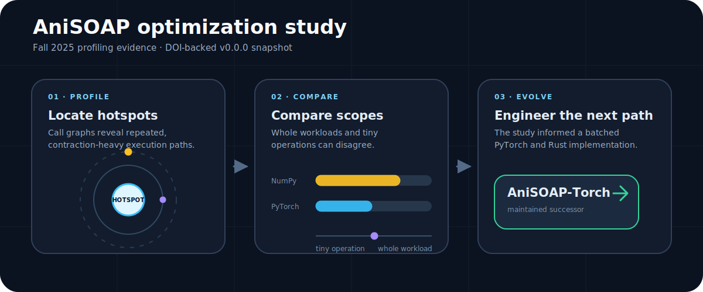
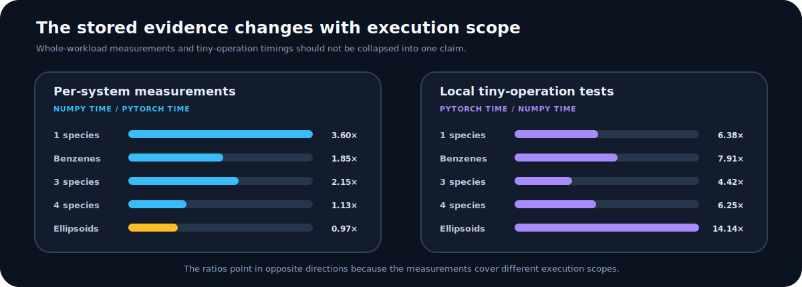

<div align="center">



**A DOI-backed Fall 2025 profiling study of NumPy and PyTorch execution paths in AniSOAP.**

[](https://doi.org/10.5281/zenodo.17519888)

[Evidence](#reading-the-evidence) · [Reproduction scope](#reproduction-scope) · [Methodology](docs/METHODOLOGY.md) · [Current implementation](https://github.com/Tejas7007/AniSOAP-Torch)

</div>

> **Study status**  
> This repository preserves the historical profiling study released as `v0.0.0`. The DOI snapshot remains citable and unchanged through its tag. For the maintained batched PyTorch and Rust implementation, numerical-parity checks, and current benchmarks, use [`AniSOAP-Torch`](https://github.com/Tejas7007/AniSOAP-Torch).

## What this repository records

The study investigated where AniSOAP descriptor computation spent time and how backend choice affected several exploratory workloads. It preserves:

- per-system NumPy and PyTorch timing records;
- local operation-level microbenchmarks with repeated trials;
- DOI-era call-graph figures used for hotspot analysis;
- compact environment metadata;
- scripts that validate the committed data and regenerate current comparison plots.

The repository is best read as the evidence trail that motivated later batching and compiled-kernel work, not as a production backend recommendation.

## Reading the evidence



Two experiment families are committed, and they answer different questions.

### Per-system measurements

The ten metric JSON files contain one NumPy and one PyTorch measurement for each workload.

| Workload | NumPy | PyTorch | NumPy time / PyTorch time |
| --- | ---: | ---: | ---: |
| One species | 0.490 s | 0.136 s | 3.60× |
| Benzenes | 0.242 s | 0.131 s | 1.85× |
| Three species | 0.393 s | 0.183 s | 2.15× |
| Four species | 0.252 s | 0.223 s | 1.13× |
| Ellipsoids | 0.213 s | 0.219 s | 0.97× |

PyTorch is faster in four of these five stored measurements. The ellipsoids record is slightly faster with NumPy.

These files contain one measurement per backend and do not preserve the complete environment, warm-up policy, input structures, or repeated-trial distribution. They support only a narrow comparison of the committed runs.

### Local operation microbenchmarks

The local table contains three repetitions for `numpy_only`, `torch_mixed`, and `torch_full` paths. For the five small stored workloads, `torch_full` takes approximately 4.42 to 14.14 times as long as NumPy.

That result does not invalidate the per-system table. Framework dispatch, allocation, conversion, and kernel-launch overhead can dominate tiny operations while larger execution paths can behave differently.

### DOI-era reported observations

The original README also reported 50-frame CHTC measurements and Apple MPS experiments. The raw CHTC logs, benchmark runner, input XYZ files, and machine-readable 50-frame table were not included in the DOI snapshot. Those values remain part of the historical narrative but are not used as the primary evidence on the current `main` branch.

See [`docs/METHODOLOGY.md`](docs/METHODOLOGY.md) for the complete interpretation boundaries.

## Reproduction scope

Install the lightweight analysis dependencies:

```bash
git clone https://github.com/Tejas7007/cersonskylab-anisoap-optimization.git
cd cersonskylab-anisoap-optimization
python -m venv .venv
source .venv/bin/activate
python -m pip install -r requirements.txt
```

Validate the committed tables:

```bash
python scripts/validate_results.py
```

Regenerate current comparison plots without overwriting DOI-era figures:

```bash
python scripts/make_plots.py
```

The generated SVG files are written to `results/generated/`, which is excluded from version control.

Capture a more complete environment report for a future rerun:

```bash
python scripts/export_env.py --output environment.json
```

These commands validate and visualize the committed evidence. They do **not** rerun the original AniSOAP benchmark because the benchmark runner and input structures are not part of the DOI snapshot.

## Repository map

| Path | Purpose |
| --- | --- |
| `results/tables/` | DOI-era machine-readable timing and environment artifacts |
| `results/figures/` | DOI-era plots and profiling call graphs |
| `results/README.md` | Data dictionary and regeneration status |
| `scripts/validate_results.py` | Internal consistency checks for committed artifacts |
| `scripts/make_plots.py` | Current plot regeneration from committed tables |
| `scripts/export_env.py` | Expanded environment capture for future reruns |
| `docs/METHODOLOGY.md` | Experimental scope, limitations, and interpretation |
| `assets/` | Current README visuals |

## What the study established

The strongest conclusion supported across the preserved evidence is not that one framework always wins. It is that AniSOAP performance is sensitive to execution scope, workload size, repeated contraction structure, conversion boundaries, and backend overhead.

The call-graph investigation identified contraction-heavy and Python-level execution paths as important optimization targets. Those observations informed the later design of [`AniSOAP-Torch`](https://github.com/Tejas7007/AniSOAP-Torch), which uses a different batching and Rust execution strategy and must be evaluated with its own benchmarks.

## Provenance

This work was developed during a **Fall 2025 Open Source Program Office internship** with the **Cersonsky Lab at the University of Wisconsin-Madison**. Arthur Lin provided day-to-day mentorship, and the Center for High Throughput Computing supported cluster experimentation.

## Citation

Cite the preserved study using the DOI:

```bibtex
@software{dahiya2025anisoap,
  author    = {Dahiya, Tejas},
  title     = {AniSOAP Optimization: High-Performance Descriptor Benchmarking},
  year      = {2025},
  publisher = {Zenodo},
  version   = {v0.0.0},
  doi       = {10.5281/zenodo.17519888},
  url       = {https://doi.org/10.5281/zenodo.17519888}
}
```

When using the maintained acceleration implementation, cite [`AniSOAP-Torch`](https://github.com/Tejas7007/AniSOAP-Torch) separately.

## License and attribution

The analysis code is available under the MIT License. AniSOAP remains an external Apache-2.0 project and is not redistributed here. See [`LICENSE`](LICENSE), [`NOTICE`](NOTICE), and [`CITATION.cff`](CITATION.cff).
